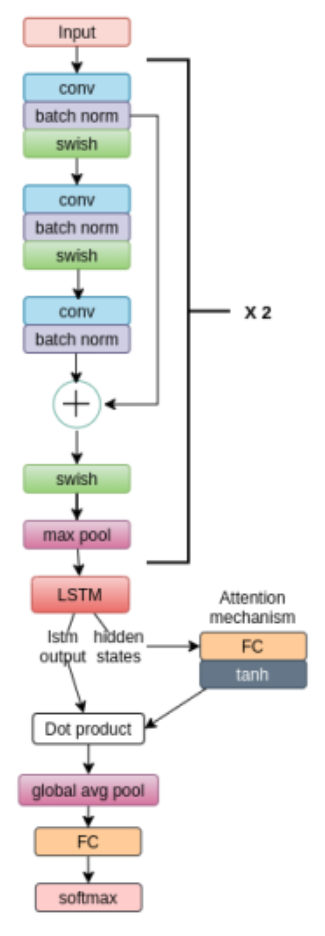

# Example of CNN-LSTM model on Arrhythmia dataset

The objective of this experiment is to show the capabilities of FLUTE in data setting relevant to the healthcare sector. 

### Federating the MIT-BIH Arrhythmia Dataset

In this experiment, a processed version of [MIT-BIH Arrhythmia Dataset](https://www.physionet.org/content/mitdb/1.0.0/) is used. In particular, we are using the dataset version found on [this Kaggle competition](https://www.kaggle.com/shayanfazeli/heartbeat). 

Excerpt from the original [MIT-BIH Arrhythmia Database](https://physionet.org/content/mitdb/1.0.0/): 

> The MIT-BIH Arrhythmia Database contains 48 half-hour excerpts of two-channel ambulatory ECG recordings, obtained from 47 subjects studied by the BIH Arrhythmia Laboratory between 1975 and 1979. Twenty-three recordings were chosen at random from a set of 4000 24-hour ambulatory ECG recordings collected from a mixed population of inpatients (about 60%) and outpatients (about 40%) at Boston's Beth Israel Hospital; the remaining 25 recordings were selected from the same set to include less common but clinically significant arrhythmias that would not be well-represented in a small random sample.

What this means for us: the federation in this example is a exemplar one, as the 47 subjects and their 48 half-hour excerpts are split up into the 109446 labeled samples of length 187. The sampling frequency is 125Hz and the number of categories is five. The categories are: 

```['N': 0, 'S': 1, 'V': 2, 'F': 3, 'Q': 4]```

Or: 

```-N : Non-ecotic beats (normal beat) -S : Supraventricular ectopic beats -V : Ventricular ectopic beats -F : Fusion Beats -Q : Unknown Beats```

The classes in the dataset are quite skewed; the *normal beats* class is present in 82.77% of samples. Using synthetic data could possibly increase the performance of the models by decreasing the class imbalance (e.g. by using [this GAN]([GitHub - mandrakedrink/ECG-Synthesis-and-Classification: 1D GAN for ECG Synthesis and 3 models: CNN, LSTM, and Attention mechanism for ECG Classification.](https://github.com/mandrakedrink/ECG-Synthesis-and-Classification)) for data synthesis) but is not too relevant for our experiment of transferring this experiment to FLUTE. 

#### Model architecture

The model architecture is largely taken from [this notebook on Kaggle](https://www.kaggle.com/polomarco/ecg-classification-cnn-lstm-attention-mechanism). The architecture has been altered to fit  the FLUTE architecture. The image below showcases the general model architecture. 



The FLUTE-ready model can be found in `model.py`. Here, `SuperNet` is the parent class of the model various model network classes. `SuperNet` contains the `loss` and `inference` methods which FLUTE expects. `SuperNet` is therefore also the `model_type` set in `config.yaml`. 

The file `centralized_model.ipynb` can be used to test a centralized run of the model. Running this model expects the csv test and train files to be added to a `.\ecg_cnn\data\mitbih\` folder. This model has higher performance than the remote model (roughly 94% as opposed to 87% accuracy). This not fully unexpected, since the federated model could have more issues dealing with the class imbalance. 

#### Preparing the data

First, place the `mitbih_test.csv` and `mitbig_train.csv` files in the folder `.\ecg_cnn\data\mitbih\`. Next, run preprocess.py in the `utils` folder to generate the HDF5 files. 

## Specifying dataset and dataloaders

Inside the `dataloaders` folder, there are two files: `dataset.py` and
`dataloader.py`. Both inherit from the base classes declared in `core`
folder, that under the hood inhereit from Pytorch classes with same name.

The dataset should be able to access all the data, and store it in the
attributes `user_list`, `user_data`, `user_data_labels` and `num_samples` (user
names, user features, user labels if the problem is supervised, and number of
samples for each user, respectively). These attributes are required to have
these exact names. Otherwise, it should also be able to access the examples of a
specific user, which id is passed during initialization via the `user_idx`
argument.

The dataloader is simpler, and essentially just instantiates the dataset and
creates batches with a specific format.

## Creating a config file

All the parameters of the experiment are passed in a YAML file. A documented
example is provided in `config.yaml`.

## Running the experiment locally

Finally, to launch the experiment, it suffices to launch the `e2e_trainer.py`
script using MPI:

`mpiexec -n 2 python .\e2e_trainer.py -dataPath experiments/ecg_cnn/data -outputPath scratch -config experiments/ecg_cnn/config.yaml -task ecg_cnn `

The `dataPath`, `outputPath` and `config` arguments should just specify the
respective files or folders, as in the example above -- in this case, a folder
called `scratch` will be created containing logs and checkpoints. The task
should be the name of the folder insider `experiments

## Running the experiments on Azure Machine Learning

In order to run the experiment on Azure Machine Learning, you first need to follow the steps described [here](#Experiments).
Make sure the HDF5 dataset is uploaded, the compute has a GPU and is running, and your YAML file is properly set up. An example file for running this experiment would be the following: 

```yaml
experiment_name: ecg_cnn_run 
description: FLUTE heartbeat dataset example 
code:
  local_path: .
compute: azureml:compute_with_gpu
environment:
  image: pytorch/pytorch:1.9.0-cuda10.2-cudnn7-devel
inputs:
  data:
    folder: azureml://datastores/workspaceblobstore/paths/data
    mode: rw_mount
command: >
  apt -y update &&
  apt -y install openmpi-bin libopenmpi-dev openssh-client &&
  python3 -m pip install --upgrade pip &&
  python3 -m pip install -r requirements.txt &&
  mpiexec --allow-run-as-root -n 4 python e2e_trainer.py
  -outputPath=./outputs
  -dataPath={inputs.data}
  -task=ecg_cnn
  -config=./experiments/ecg_cnn/config.yaml

```
To run your job, you can then use the following command: 
`az ml job create -f ./run.yaml -w "YourWorkspaceName" -g "YourResourceGroup"`

The job should now be created and uploaded, after which it can be found in the AzureML Studio. 